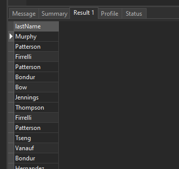
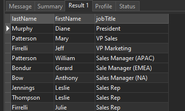

# MySQL SELECT

## Introduction to MySQL SELECT statement

The SELECT statement allows you to select data from one or more tables. To write a SELECT statement in MySQL, you use this syntax:

```sql
SELECT select_list
FROM table_name;
```

In this syntax:

- First, specify one or more columns from which you want to select data after the SELECT keyword. If the select_list has multiple columns, you need to separate them by a comma (,).
- Second, specify the name of the table from which you want to select data after the FROM keyword.

The semicolon ( ; ) is optional. It denotes the end of a statement. If you have two or more statements, you need to use the semicolon( ; ) to separate them so that MySQL will execute each statement individually.

The SELECT and FROM are the keywords. By convention, you write the SQL keywords in uppercase. However, it’s not mandatory. Because SQL is case-insensitive, you can write the SQL statement in lowercase, uppercase, etc. For example:

```sql
select select_list
from table_name;
```

When executing the SELECT statement, MySQL evaluates the FROM clause before the SELECT clause:


## MySQL SELECT statement examples

We’ll use the employees table in the sample database for the following examples.


The employees table has eight columns: employeeNumber, lastName, firstName, extension, email, officeCode, reportsTo, and jobTitle. The table also has many rows as shown in the following picture:


## A) Using the MySQL SELECT statement to retrieve data from a single column example

The following example uses the SELECT statement to select the last names of all employees:

```sql
SELECT lastName
FROM employees;
```

Output:


The result of a SELECT statement is called a result set as it’s a set of rows that results from the query.

## B) Using the MySQL SELECT statement to query data from multiple columns example

The following example uses the SELECT statement to get the first name, last name, and job title of employees:

```sql
SELECT
    lastName,
    firstName,
    jobTitle
FROM
    employees;
```

Output:

Even though the employees table has many columns, the SELECT statement returns data of three columns lastName, firstName, and jobTitle specified in the SELECT clause:

## C) Using the MySQL SELECT statement to retrieve data from all columns example

If you want to select data from all the columns of the employees table, you can specify all the column names in the SELECT clause like this:

```sql
SELECT employeeNumber,
       lastName,
       firstName,
       extension,
       email,
       officeCode,
       reportsTo,
       jobTitle
FROM   employees;
```

Alternatively, you can use the asterisk (\*) which is the shorthand for all columns. For example:

```sql
SELECT *
FROM employees;
```

The query returns data from all the columns of the employees table.

The SELECT _ is often called “select star” or “select all” since it selects data from all columns of the table. In practice, you should use the SELECT _ for the ad-hoc queries only.

If you embed the SELECT statement in the code such as PHP, Java, Python, Node.js, you should explicitly specify the columns from which you want to select data.

## SUMMARY

- Use the SELECT statement to select data from a table.
- Use the SELECT \* to select data from all columns of a table.
