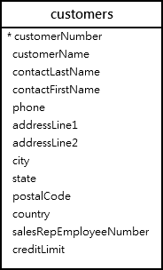

# MySQL DISTINCT

## Introduction to MySQL DISTINCT clause

When querying data from a table, you may get duplicate rows. To remove these duplicate rows, you use the DISTINCT clause in the SELECT statement.

Here’s the syntax of the DISTINCT clause:

```sql
SELECT DISTINCT
    select_list
FROM
    table_name
WHERE
    search_condition
ORDER BY
    sort_expression;
```

In this syntax, you specify one or more columns that you want to select distinct values after the SELECT DISTINCT keywords.

If you specify one column, the DISTINCT clause will evaluate the uniqueness of rows based on the values of that column.

However, if you specify two or more columns, the DISTINCT clause will use the values of these columns to evaluate the uniqueness of the rows.

When executing the SELECT statement with the DISTINCT clause, MySQL evaluates the DISTINCT clause after the FROM, WHERE, and SELECT clause and before the ORDER BY clause:


## MySQL DISTINCT clause examples

We’ll use the employees table from the sample database:


First, select the last names from the employees table using the following SELECT statement:

```sql
SELECT
    lastname
FROM
    employees
ORDER BY
    lastname;
```

As shown clearly in the output, some employees have the same last names e.g.,Bondur,Firrelli .

Second, select unique last names by adding the DISTINCT clause like this:

```sql
SELECT
    DISTINCT lastname
FROM
    employees
ORDER BY
    lastname;
```

As you can see clearly from the output, the DISTINCT clause removes the duplicate last names from the result set.

## MySQL DISTINCT and NULL values

When you specify a column that has NULL values in the DISTINCT clause, the DISTINCT clause will keep only one NULL value because it considers all NULL values are the same.

For example, the state column in the customers table has NULL values.



When you use the DISTINCT clause to query the states, you will see distinct states and NULL as follows:

```sql
SELECT DISTINCT state
FROM customers;
```

## MySQL DISTINCT with multiple columns

When you specify multiple columns in the DISTINCT clause, the DISTINCT clause will use the combination of values in these columns to determine the uniqueness of the row in the result set.

For example, to get a unique combination of city and state from the customers table, you use the following query:

```sql
SELECT DISTINCT
    state, city
FROM
    customers
WHERE
    state IS NOT NULL
ORDER BY
    state,
    city;
```

Without the DISTINCT clause, you will get the duplicate combination of state and city as follows:

```sql
SELECT
    state, city
FROM
    customers
WHERE
    state IS NOT NULL
ORDER BY
    state ,
    city;
```

## Summary

- Use the MySQL DISTINCT clause to remove duplicate rows from the result set returned by the SELECT clause.
