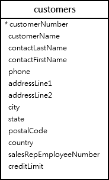

# MySQL OR Operator

## Introduction to the MySQL OR operator

The MySQL OR operator is a logical operator that combines two Boolean expressions.

```sql
A OR B
```

If both A and B are not NULL, the OR operator returns 1 (true) if either A or B is non-zero. For example:

```sql
SELECT 1 OR 1, 1 OR 0, 0 OR 1;
```

If both A and B are zero (false), the OR operator returns zero. For example:

```sql
SELECT 0 OR 0;
```

When A and / or B is NULL, the OR operator returns 1 (true) if either A or B is non-zero. Otherwise, it returns NULL. For example:

```sql
SELECT 1 OR NULL, 0 OR NULL, NULL or NULL;
```

The following table shows the result of the OR operator when combining true (non-zero), false (zero), and NULL:

|       | TRUE | FALSE | NULL |
| ----- | ---- | ----- | ---- |
| TRUE  | TRUE | TRUE  | TRUE |
| FALSE | TRUE | FALSE | NULL |
| NULL  | TRUE | NULL  | NULL |

## MySQL OR operator and short-circuit evaluation

Like the AND operator, the OR operator is also short-circuited. In other words, MySQL stops evaluating the remaining parts of the expression as soon as it can determine the result. For example:

```sql
SELECT 1 = 1 OR 1 / 0;
```

Because the expression 1 = 1 always returns 1, MySQL won’t evaluate the 1 / 0 expression. And MySQL would issue an error if it did.

## Operator precedence

When an expression contains both AND and OR operators, MySQL uses the operator precedence to determine the order of evaluation of the operators. MySQL evaluates the operator with higher precedence first.

Since the AND operator has higher precedence than the OR operator, MySQL evaluates the AND operator before the OR operator. For example:

```sql
SELECT 1 OR 0 AND 0;
```

How it works.

```sql
1 OR 0 AND 0 = 1 OR 0 = 1
```

To change the order of evaluation, you use the parentheses. For example:

```sql
SELECT (1 OR 0) AND 0;
```

How it works.

```sql
(1 OR 0) AND 0 = 1 AND 0 = 0
```

## MySQL OR operator examples

We’ll use the customers table from the sample database for the demonstration.



The following query uses the OR operator in the WHERE clause to select all the customers located in the USA or France:

```sql
SELECT
	customername,
	country
FROM
	customers
WHERE country = 'USA' OR
      country = 'France';
```

The following example uses the OR operator to select the customers who locate in the USA or France and have a credit limit greater than 100,000.

```sql
SELECT
	customername,
	country,
	creditLimit
FROM
	customers
WHERE(country = 'USA'
		OR country = 'France')
	  AND creditlimit > 100000;
```

Notice that if you do not use the parentheses, the query will return the customers who locate in the USA or the customers located in France with a credit limit greater than 100,000.

```sql
SELECT
    customername,
    country,
    creditLimit
FROM
    customers
WHERE
    country = 'USA'
    OR country = 'France'
    AND creditlimit > 100000;
```

Summary

- The OR operator combines two Boolean expressions and returns true when either expression is true. Otherwise, it returns false.
- MySQL evaluates the OR operator after the AND operator if an expression contains both AND and OR operators.
- Use parentheses to change the order of evaluation.
