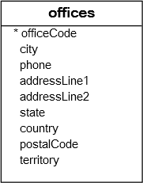

# MySQL IN

## Introduction to MySQL IN operator

The IN operator allows you to determine if a value matches any value in a list of values. Here’s the syntax of the IN operator:

```sql
value IN (value1, value2, value3,...)
```

The IN operator returns 1 (true) if the value equals any value in the list (value1, value2, value3,…). Otherwise, it returns 0.

In this syntax:

- First, specify the value to test on the left side of the IN operator. The value can be a column or an expression.
- Second, specify a comma-separated list of values to match in the parentheses.

The IN operator is functionally equivalent to the combination of multiple OR operators:

```sql
value = value1 OR value = value2 OR value = value3 OR ...
```

The following example returns 1 because 1 is in the list:

```sql
SELECT 1 IN (1,2,3);
```

The following example returns 0 because 4 is not in the list:

```sql
SELECT 4 IN (1,2,3);
```

In practice, you’ll use the IN operator to form conditions in a WHERE clause of the SELECT, DELETE, and UPDATE statements. Also, you’ll use the IN operator in a query that contains a subquery.

## MySQL IN operator and NULL

Generally, the IN operator returns NULL in two cases:

- The value on the left side of the operator is NULL.
- The value doesn’t equal any value in the list and one of values in the list is NULL.

The following example returns NULL because the value of the left side of the IN operator is NULL:

```sql
SELECT NULL IN (1,2,3);
```

The following example also returns NULL because the 0 is not equal to any value in the list and the list has one NULL:

```sql
SELECT 0 IN (1 , 2, 3, NULL);
```

The following example also returns NULL because NULL is not equal to any value in the list and the list has one NULL. Note that NULL is not equal to NULL.

```sql
SELECT NULL IN (1 , 2, 3, NULL);
```

## MySQL IN operator examples

See the following offices table from the sample database:



The following example uses the IN operator to find the offices located in the USA and France:

```sql
SELECT
    officeCode,
    city,
    phone,
    country
FROM
    offices
WHERE
    country IN ('USA' , 'France');
```

You can also get the same result with the OR operator like this:

```sql
SELECT
    officeCode,
    city,
    phone
FROM
    offices
WHERE
    country = 'USA' OR country = 'France';
```

In case the list has many values, you need to construct a very long statement with multiple OR operators. Hence, the IN operator allows you to shorten the query and make it more readable.

## Summary

- Use the IN operator to check if a value is in a set of values.
- Use the IN operator to form a condition for the WHERE clause.
