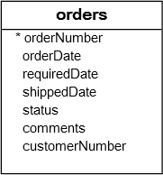

# MySQL BETWEEN

## Introduction to SUBTOPIC

The BETWEEN operator is a logical operator that specifies whether a value is in a range or not. Here’s the syntax of the BETWEEN operator:

```sql
value BETWEEN low AND high;
```

The BETWEEN operator returns 1 if:

```sql
value >= low AND value <= high
```

Otherwise, it returns 0.

If the value, low, or high is NULL, the BETWEEN operator returns NULL .

For example, the following statement returns 1 because 15 is between 10 and 20:

```sql
SELECT 15 BETWEEN 10 AND 20;
```

The following example returns 0 because 15 is not between 20 and 30:

```sql
SELECT 15 BETWEEN 20 AND 30;
```

---

**_NOTE:_** MySQL treats 1 as true and 0 as false.

---

The NOT BETWEEN operator returns 1 if:

### NOT BETWEEN

To negate the BETWEEN operator, you use the NOT operator:

```sql
value NOT BETWEEN low AND high
```

The NOT BETWEEN operator returns 1 if:

```sql
value < low OR value > high
```

Otherwise, it returns 0.

For example, the following statement returns 0 because 15 is not between 10 and 20 is not true:

```sql
SELECT 15 NOT BETWEEN 10 AND 20;
```

In practice, you’ll use the BETWEEN operator in the WHERE clause of the SELECT, UPDATE, and DELETE statements.

## MySQL BETWEEN operator examples

Let’s practice with some examples of using the BETWEEN operator.

### 1) Using MySQL BETWEEN with number examples

See the following products table in the sample database:


The following example uses the BETWEEN operator to find products whose buy prices between 90 and 100:

```sql
SELECT
    productCode,
    productName,
    buyPrice
FROM
    products
WHERE
    buyPrice BETWEEN 90 AND 100;
```

This query uses the greater than or equal (>=) and less than or equal ( <= ) operators instead of the BETWEEN operator to get the same result:

```sql
SELECT
    productCode,
    productName,
    buyPrice
FROM
    products
WHERE
    buyPrice >= 90 AND buyPrice <= 100;
```

To find the products whose buy prices are not between $20 and $100, you use the NOT BETWEEN operator as follows:

```sql
SELECT
    productCode,
    productName,
    buyPrice
FROM
    products
WHERE
    buyPrice NOT BETWEEN 20 AND 100;
```

You can rewrite the query above using the less than (<), greater than (>), and the logical operator (AND) like this:

```sql
SELECT
    productCode,
    productName,
    buyPrice
FROM
    products
WHERE
    buyPrice < 20 OR buyPrice > 100;
```

### 2) Using MySQL BETWEEN operator with dates example

See the following orders table:



To check if a value is between a date range, you should explicitly cast the value to the DATE type.

For example, the following statement returns the orders with the required dates between 01/01/2003 to 01/31/2003:

```sql
SELECT
   orderNumber,
   requiredDate,
   status
FROM
   orders
WHERE
   requireddate BETWEEN
     CAST('2003-01-01' AS DATE) AND
     CAST('2003-01-31' AS DATE);
```

In this example, we use the CAST() to cast the literal string '2003-01-01' into a DATE value:

```sql
CAST('2003-01-01' AS DATE)
```

## Summary

- Use the MySQL BETWEEN operator to test if a value falls within a range of values.
