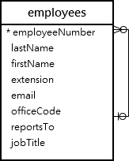

# MySQL SUBTOPICHERE

## Introduction to MySQL LIKE operator

The LIKE operator is a logical operator that tests whether a string contains a specified pattern or not.

Here’s the syntax of the LIKE operator:

```sql
expression LIKE pattern ESCAPE escape_character
```

In this syntax, if the expression matches the pattern, the LIKE operator returns 1. Otherwise, it returns 0.

MySQL provides two wildcard characters for constructing patterns: percentage % and underscore \_ .

- The percentage ( % ) wildcard matches any string of zero or more characters.
- The underscore ( \_ ) wildcard matches any single character.

For example, s% matches any string starts with the character s such as sun and six. The se\_ matches any string starts with se and is followed by any character such as see and sea.

When the pattern contains the wildcard character and you want to treat it as a regular character, you can use the ESCAPE clause.

Typically, you’ll use the LIKE operator in the WHERE clause of the SELECT , DELETE, and UPDATE statement.

## MySQL LIKE operator examples

Let’s practice with some examples of using the LIKE operator. We will use the following employees table from the sample database for the demonstration:



### A) Using MySQL LIKE operator with the percentage (%) wildcard examples

This example uses the LIKE operator to find employees whose first names start with the letter a:

```sql
SELECT
    employeeNumber,
    lastName,
    firstName
FROM
    employees
WHERE
    firstName LIKE 'a%';
```

In this example, MySQL scans the whole employees table to find employees whose first names start with the letter a and are followed by any number of characters.

This example uses the LIKE operator to find employees whose last names end with the literal string on e.g., Patterson, Thompson:

```sql
SELECT
    employeeNumber,
    lastName,
    firstName
FROM
    employees
WHERE
    lastName LIKE '%on';
```

To check if a string contains a substring, you can use the percentage ( % ) wildcard at the beginning and the end of the substring.

For example, the following query uses the LIKE operator to find all employees whose last names contain the substring on:

```sql
SELECT
    employeeNumber,
    lastName,
    firstName
FROM
    employees
WHERE
    lastname LIKE '%on%';
```

### B) Using MySQL LIKE operator with underscore( \_ ) wildcard examples

To find employees whose first names start with the letter T , end with the letter m, and contain any single character between e.g., Tom , Tim, you use the underscore (\_) wildcard to construct the pattern as follows:

```sql
SELECT
    employeeNumber,
    lastName,
    firstName
FROM
    employees
WHERE
    firstname LIKE 'T_m';
```

### C) Using MySQL NOT LIKE operator example

The MySQL allows you to combine the NOT operator with the LIKE operator to find a string that does not match a specific pattern.

Suppose you want to search for employees whose last names don’t start with the letter B, you can use the NOT LIKE operator as follows:

```sql
SELECT
    employeeNumber,
    lastName,
    firstName
FROM
    employees
WHERE
    lastName NOT LIKE 'B%';
```

---

**_NOTE:_** The pattern is not case-sensitive. Therefore, the b% and B% patterns return the same result.

---

```sql
Sample Code
```

### MySQL LIKE operator with the ESCAPE clause

Sometimes the pattern may contain the wildcard characters e.g., 10%, \_20, etc.

In this case, you can use the ESCAPE clause to specify the escape character so that the LIKE operator interprets the wildcard character as a literal character.

If you don’t specify the escape character explicitly, the backslash character (\) is the default escape character.

For example, if you want to find products whose product codes contain the string \_20 , you can use the pattern %\_20% with the default escape character:

```sql
SELECT
    productCode,
    productName
FROM
    products
WHERE
    productCode LIKE '%\_20%';
```

Alternatively, you can specify a different escape character e.g., $ using the ESCAPE clause:

```sql
SELECT
    productCode,
    productName
FROM
    products
WHERE
    productCode LIKE '%$_20%' ESCAPE '$';
```

The pattern %$\_20% matches any string that contains the \_20 string.

## Summary

- Use the LIKE operator to test if a value matches a pattern.
- The % wildcard matches zero or more characters.
- The \_ wildcard matches a single character.
- Use ESCAPE clause specifies an escape character other than the default escape character (\).
- Use the NOT operator to negate the LIKE operator.
