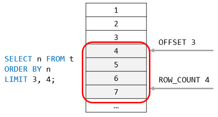

# MySQL LIMIT

## Introduction to MySQL LIMIT clause

The LIMIT clause is used in the SELECT statement to constrain the number of rows to return. The LIMIT clause accepts one or two arguments. The values of both arguments must be zero or positive integers.

The following illustrates the LIMIT clause syntax with two arguments:

```sql
SELECT
    select_list
FROM
    table_name
LIMIT [offset,] row_count;
```

In this syntax:

- The offset specifies the offset of the first row to return. The offset of the first row is 0, not 1.
- The row_count specifies the maximum number of rows to return.

The following picture illustrates the LIMIT clause:


When you use the LIMIT clause with one argument, MySQL will use this argument to determine the maximum number of rows to return from the first row of the result set.

Therefore, these two clauses are equivalent:

```sql
LIMIT row_count;
```

And

```sql
LIMIT 0 , row_count;
```

In addition to the above syntax, MySQL provides the following alternative LIMIT clause syntax:

```sql
LIMIT row_count OFFSET offset
```

## The LIMIT and ORDER BY clauses

By default, the SELECT statement returns rows in an unspecified order. When you add the LIMIT clause to the SELECT statement, the returned rows are unpredictable.

Therefore, to ensure the LIMIT clause returns an expected output, you should always use it with an ORDER BY clause like this:

```sql
SELECT
    select_list
FROM
    table_name
ORDER BY
    sort_expression
LIMIT offset, row_count;
```

## MySQL LIMIT clause examples

We’ll use the customers table from the sample database for demonstration.


### 1) Using MySQL LIMIT to get the highest or lowest rows

This statement uses the LIMIT clause to get the top five customers who have the highest credit:

```sql
SELECT
    customerNumber,
    customerName,
    creditLimit
FROM
    customers
ORDER BY creditLimit DESC
LIMIT 5;
```

In this example:

- First, the ORDER BY clause sorts the customers by credits in high to low.
- Then, the LIMIT clause returns the first 5 rows.

Similarly, this example uses the LIMIT clause to find five customers who have the lowest credits:

```sql
SELECT
    customerNumber,
    customerName,
    creditLimit
FROM
    customers
ORDER BY creditLimit
LIMIT 5;
```

In this example:

- First, the ORDER BY clause sorts the customers by credits in low to high.
- Then, the LIMIT clause returns the first 5 rows.

Because there are more than 5 customers that have credits zero, the result of the query above may lead to an inconsistent result.

To fix this issue, you need to add more columns to the ORDER BY clause to constrain the row in unique order:

```sql
SELECT
    customerNumber,
    customerName,
    creditLimit
FROM
    customers
ORDER BY
    creditLimit,
    customerNumber
LIMIT 5;
```

### 2) Using MySQL LIMIT clause for pagination

When you display data on the screen, you often want to divide rows into pages, where each page contains a limited number of rows like 10 or 20.

To calculate the number of pages, you take the total rows divided by the number of rows per page. For fetching rows of a specific page, you can use the LIMIT clause.

This query uses the COUNT(\*) aggregate function to get the total rows from the customers table:

```sql
SELECT
    COUNT(*)
FROM
    customers;
```

Suppose that each page has 10 rows; to display 122 customers, you have 13 pages. The last 13th page contains two rows only.

This query uses the LIMIT clause to get rows of page 1 which contains the first 10 customers sorted by the customer name:

```sql
SELECT
    customerNumber,
    customerName
FROM
    customers
ORDER BY customerName
LIMIT 10;
```

This query uses the LIMIT clause to get the rows of the second page that include rows 11 – 20:

```sql
SELECT
    customerNumber,
    customerName
FROM
    customers
ORDER BY customerName
LIMIT 10, 10;
```

### 3) Using MySQL LIMIT to get the nth highest or lowest value

To get the nth highest or lowest value, you use the following LIMIT clause:

```sql
SELECT select_list
FROM table_name
ORDER BY sort_expression
LIMIT n-1, 1;
```

The clause LIMIT n-1, 1 returns 1 row starting at the row n.

For example, the following finds the customer who has the second-highest credit:

```sql
    SELECT
        customerName,
        creditLimit
    FROM
        customers
    ORDER BY
        creditLimit DESC
    LIMIT 1,1;
```

Let’s double-check the result. This query returns all customers sorted by credits from high to low:

```sql
SELECT
    customerName,
    creditLimit
FROM
    customers
ORDER BY
    creditLimit DESC;
```

As you can see clearly from the output, the result was correct as expected.

## MySQL LIMIT & DISTINCT clauses

If you use the LIMIT clause with the DISTINCT clause, MySQL immediately stops searching when it finds the number of unique rows specified in the LIMIT clause.

The example uses the LIMIT clause with the DISTINCT clause to return the first five unique states in the customers table:

```sql
SELECT DISTINCT
    state
FROM
    customers
WHERE
    state IS NOT NULL
LIMIT 5;
```

## Summary

- Use the MySQL LIMIT clause to constrain the number of rows returned by the SELECT statement.
